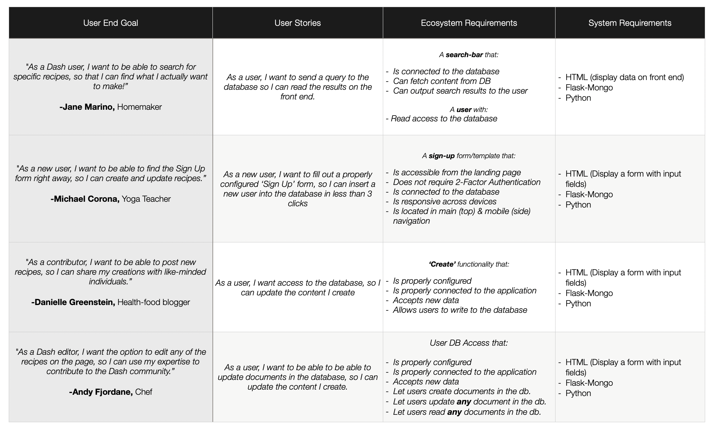

# Dash

Dash is an online cookbook for men & women, (ages 24 - 39), who lead healthy lifestyles and wish to find and share recipes with like-minded individuals.

## UX

As the Milestone 3 Project for [Code Institute's](https://codeinstitute.net/) Data Centric Development portion of the Full Stack Developer Program, this project was built with HTML, CSS, JavaScript, jQuery, Materialize, Python, Flask and MongoDB.

Dash's target market is health-minded adult men & women, ages 24 - 29, that wish to find and share recipes. The target market also seeks a place to manage their own recipes and ingredients.

User stories were created during the Strategy/Planning Phase of this project:

User Story 1:

> *"As a daily Dash user, I want to search for specific recipes, so that I can find the type of stuff I actually want to make! "*
>> -Jane Marino

User Story 2:

> *"As a new user, I want to be able to create an account easily so that I can find and share recipes right away"*
>> -Michael Corona

User Story 3:

> *"As a user, I want to be able to post recipes of my own, so I can share them with like-minded individuals."*
>> -Danielle Greenstein

The user story worksheet that was completed during the Strategy Plane portion of this project can be viewed here:

 The following wireframes were created by the developer to guide the development proess:

## Features

In this section, you should go over the different parts of your project, and describe each in a sentence or so.

### Existing Features

- Feature 1 - allows users X to achieve Y, by having them fill out Z

For some/all of your features, you may choose to reference the specific project files that implement them, although this is entirely optional.

In addition, you may also use this section to discuss plans for additional features to be implemented in the future:

### Features Left to Implement

- Another feature idea

## Technologies Used

In this section, you should mention all of the languages, frameworks, libraries, and any other tools that you have used to construct this project. For each, provide its name, a link to its official site and a short sentence of why it was used.

- [JQuery](https://jquery.com)

- The project uses **JQuery** to simplify DOM manipulation.

## Testing

In this section, you need to convince the assessor that you have conducted enough testing to legitimately believe that the site works well. Essentially, in this part you will want to go over all of your user stories from the UX section and ensure that they all work as intended, with the project providing an easy and straightforward way for the users to achieve their goals.

Whenever it is feasible, prefer to automate your tests, and if you've done so, provide a brief explanation of your approach, link to the test file(s) and explain how to run them.

For any scenarios that have not been automated, test the user stories manually and provide as much detail as is relevant. A particularly useful form for describing your testing process is via scenarios, such as:

1. Contact form:
    1. Go to the "Contact Us" page
    2. Try to submit the empty form and verify that an error message about the required fields appears
    3. Try to submit the form with an invalid email address and verify that a relevant error message appears
    4. Try to submit the form with all inputs valid and verify that a success message appears.

In addition, you should mention in this section how your project looks and works on different browsers and screen sizes.

You should also mention in this section any interesting bugs or problems you discovered during your testing, even if you haven't addressed them yet.

If this section grows too long, you may want to split it off into a separate file and link to it from here.

## Deployment

This section should describe the process you went through to deploy the project to a hosting platform (e.g. GitHub Pages or Heroku).

In particular, you should provide all details of the differences between the deployed version and the development version, if any, including:

- Different values for environment variables (Heroku Config Vars)?
- Different configuration files?
- Separate git branch?

In addition, if it is not obvious, you should also describe how to run your code locally.

## Credits

### Content

### Media

- The photos used in this site were obtained from ...

### Acknowledgements

- I received markdown instructions from this [Markdown Cheatsheet](https://github.com/adam-p/markdown-here/wiki/Markdown-Cheatsheet#blockquotes)

- I received UX inspiration from [Awwwards](https://www.awwwards.com)

- I received UX inspiration from [Behance](https://www.behance.net)

- I took suggestions from [Prototypr's article, '7 Best UX Practices for Designing Long Online Forms'](https://blog.prototypr.io/seven-best-ux-practices-for-designing-long-online-forms-6a670e488bad)